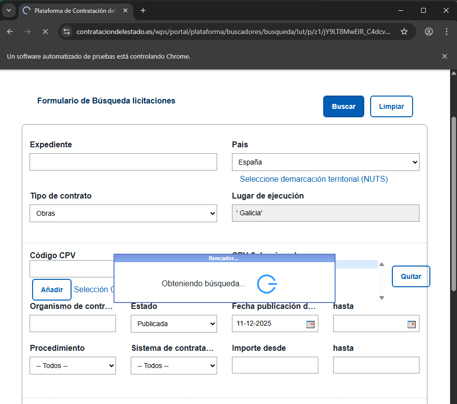
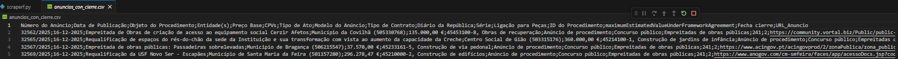
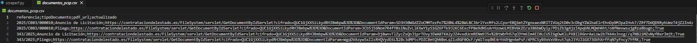

# Pipeline de Scraping Licitaciones España-Portugal

## Descripción
Script Python unificado que automatiza la extracción, normalización y detección de novedades en licitaciones de obras públicas de **España (PCSP)** y **Portugal (Diário da República)**. Genera CSVs listos para importar en aplicaciones de gestión, detectando 
automáticamente licitaciones nuevas y actualizaciones de documentos. Integra scraping, control incremental y lógica de delta vs histórico en un único pipeline robusto. Permite automatizar la alimentación del dashboard de licitaciones de la empresa.

## Tecnologías utilizadas
- **Scraping**: Selenium + WebDriverManager (Chrome headless-ready)  
- **Procesado**: Pandas (normalización, merges, deltas)  
- **Persistencia**: CSVs incrementales con control de cambios  
- **Parsing**: Manejo de fechas locales y formatos numéricos  

## Flujo del Pipeline

### 1. Scraping España (PCSP)
  
Búsqueda avanzada en Plataforma de Contratación del Sector Público, filtrando por zonas NUTS (Galicia, Zamora, etc). Solo licitaciones de obras en estado publicado y actualizadas en los últimos 7 días para poder estar al tanto de posibles actualizaciones de documentos.

**Salida**: `obras_maestroES.csv` (maestro incremental)

### 2. Scraping Portugal (Diário da República)  
  
Para cada referencia de Licitación de `anuncios.csv` (csv que se puede extraer directamente de la plataforma www.base.gov.pt), busca el anuncio oficial y extrae fecha de cierre + URL del anuncio (datos que no están incluídos en el csv que se puede extraer de la plataforma).

**Salida**: `obras_maestroPT.csv` (formato app-ready) + `anuncios_con_cierre.csv`

### 3. Control Documentos PCSP
  
Visita cada licitación española, extrae fecha de presentación/BOE y compara PDFs de documentos vs histórico. Detecta cambios sin descargar ficheros.

**Salida**: `documentos_pcsp.csv` (con flag `actualizado`) + flag `docs_actualizados` por licitación

### 4. Dataset Consolidado + Delta
  
Une ES+PT en formato normalizado. Compara vs histórico para generar solo nuevas licitaciones y actualizaciones de documentos.

**Salidas clave**:
- `licitaciones_para_app.csv` (dataset completo)  
- `licitaciones_para_app_actualizaciones.csv` (solo novedades)

## Características técnicas destacadas

- **Scraping incremental**: No reprocesa licitaciones ya tratadas  
- **Detección inteligente de cambios**: Compara URLs de PDFs por tipo de documento  
- **Enlaces normalizados**: `Anuncio de licitación;URL` (PCSP/ContratosGalicia/Diário)  
- **Paginación robusta**: Manejo de `staleness_of` en PCSP  
- **Formato app-ready**: Campos estandarizados (numero_expediente, boe, presupuesto, enlaces, docs_actualizados)  

## Beneficios
- **Automatización completa**: De web oficial → CSV listo para app en un solo ejecutable  
- **Control fino de novedades**: Solo procesa deltas (nuevas + docs actualizados)  
- **Mantenimiento mínimo**: Lógica incremental evita reprocesos  
- **Escalable**: Fácil añadir nuevas zonas NUTS o fuentes  
- **Auditable**: Históricos completos de documentos y cambios detectados
